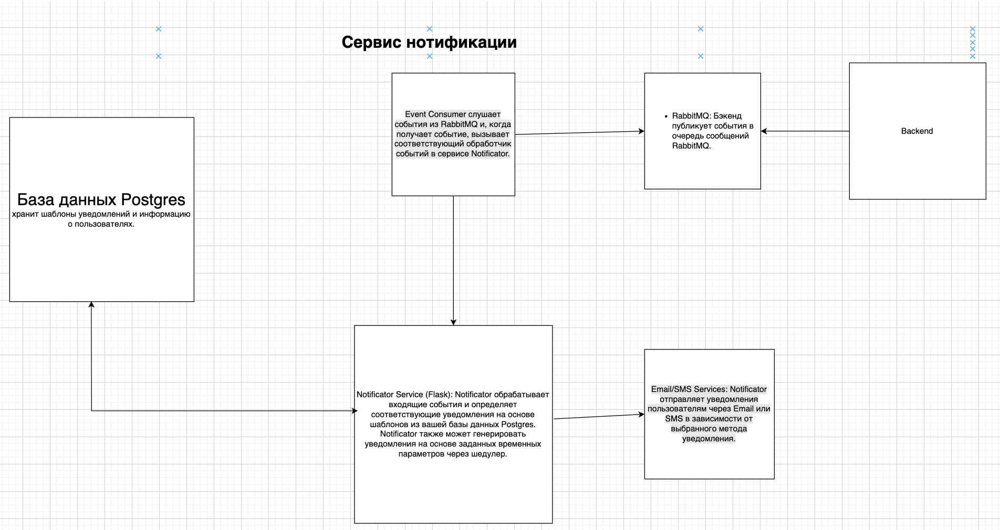

Notification service
================================================================================================
## Architecture 
Схема представлена ниже

Backend: Бэкенд генерирует события, которые могут быть связаны с активностями в вашем онлайн-кинотеатре.

RabbitMQ: Бэкенд публикует события в очередь сообщений RabbitMQ.

Event Consumer: Event Consumer слушает события из RabbitMQ и, когда получает событие, вызывает соответствующий обработчик событий в сервисе Notificator.

Notificator Service: Notificator обрабатывает входящие события и определяет соответствующие уведомления на основе шаблонов из вашей базы данных Postgres. Notificator также может генерировать уведомления на основе заданных временных параметров через шедулер.

Postgres Database: База данных Postgres хранит шаблоны уведомлений и информацию о пользователях.

Email/SMS Services: Notificator отправляет уведомления пользователям через Email или SMS в зависимости от выбранного метода уведомления.

RabbitMQ DLQ (Dead Letter Queue): Если по какой-то причине сообщение не может быть обработано (например, если Notificator недоступен), оно отправляется в DLQ для последующей обработки.

## Usage
 - #TODO

## Developers
- Антон Костюченко (askostyu)
- Георгий Андреев (everyoneismyfriend)
- Журавков Владислав (Shuich1)
- Широченко Дмитрий (dmshirochenko)
